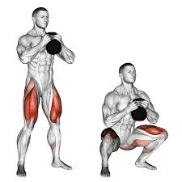
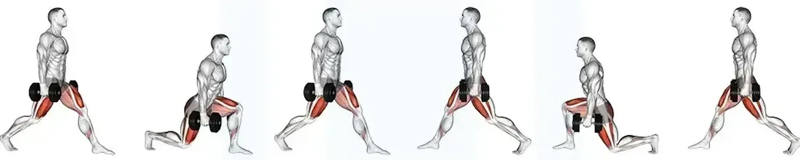
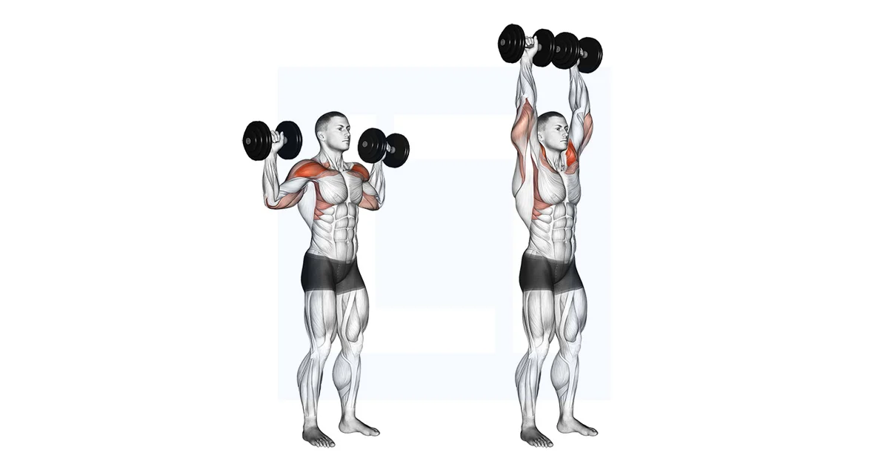
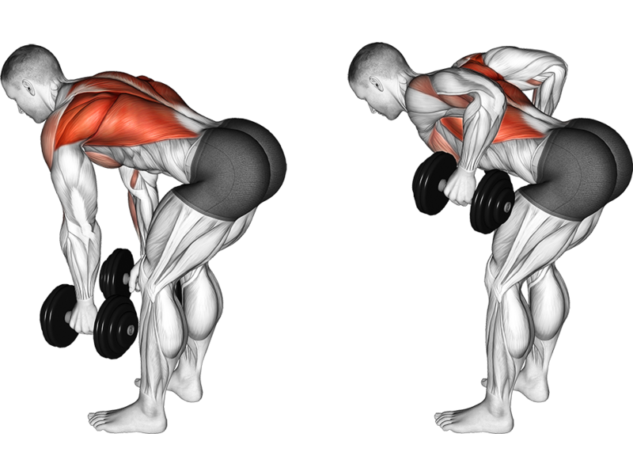
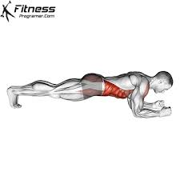

> 179cm | 76kg → 70kg | 3 Months | No Excuses

Hey Sam, this is your roadmap. 12 weeks from now, the gut is gone and the muscle shows. Simple moves, consistent effort, real results. Let's get it done.

---

## 1. Your Weekly Rhythm (5 On / 2 Off)

Smart recovery is part of the plan, not a weakness.

| Day | What You're Doing | Details |
|---|---|---|
| Mon | REST | Walk 5k-8k steps, stretch, recover |
| Tue | Combo A | 20m Dumbbells + 10m Treadmill (12% Incline) |
| Wed | Swim | 30-40m Frog Style — long glides, steady pace |
| Thu | Combo B | 20m Dumbbells + 10m Treadmill (12% Incline) |
| Fri | REST | Walk 5k-8k steps, stretch, recover |
| Sat | Combo A | 20m Dumbbells + 10m Treadmill (12% Incline) |
| Sun | Swim | 30-40m Frog Style — push the lap speed |

---

## 2. The 20-Minute Dumbbell Circuit

5 moves, back to back. That's one round. Rest 60 seconds, then go again. Hit 3-4 rounds total. No sitting down between moves, Sam.

**1. Goblet Squats — 12 Reps**
Hold one dumbbell at your chest. Sit deep, thighs parallel to the floor. Own the bottom position.

**2. Dumbbell Lunges — 10 Reps per Leg**
Dumbbells at your sides. Step forward, both knees hit 90 degrees. Keep your chest up — don't lean forward.

**3. Overhead Press — 10 Reps**
Stand tall, press the dumbbells from shoulders to ceiling. Squeeze your glutes hard to protect your lower back.

**4. Dumbbell Rows — 12 Reps**
Lean forward at 45 degrees, back flat like a table. Pull the dumbbells to your hips and squeeze your shoulder blades together at the top.

**5. Weighted Plank — 45 Seconds**
Elbows down, body straight as a board. Place a weight plate or small dumbbell on your lower back. Don't let your hips sag.

---

## 3. The 10-Minute Treadmill Belly Finisher

Do this right after the weights. Your body is already burning — this is where the belly fat melts.

* **Incline:** Lock it at 12%
* **Speed:** 3.0 mph brisk walk
* **The Rule:** No holding the handrails. Swing your arms, engage your core. This is non-negotiable, Sam.

---

## 4. Sam's "70kg Goal" Diet

High protein, controlled carbs. The kitchen is where you actually lose the weight.

* **Fasted Morning:** Train on an empty stomach. Water or black coffee only.
* **Breakfast (Post-Workout):** 200g Greek Yogurt + 250ml HL Milk + 2 Eggs + 15g Almonds + 2 Oat Bread + 3 Fruits
* **Lunch / Dinner:** 1 Meat + 2 Veg + 0.5 Rice
* **Rest Day Tweak (Mon/Fri):** Drop to 1 Oat Bread. Zero rice at lunch/dinner.

---

## 5. Progression — Level Up Every 4 Weeks

Your body adapts fast. If it stops being hard, you stop making progress. Force the change.

| Month | Dumbbell Weight | Treadmill Speed | Plank |
|---|---|---|---|
| Month 1 | 8-10kg (starting weight) | 3.0 mph | Bodyweight or 2.5kg |
| Month 2 | +2kg on all lifts | 3.2-3.4 mph | +5kg plate |
| Month 3 | +2kg again | 3.5 mph or 1min slow run | Hold for 60 secs |

* **Month 1:** Perfect your form. Feel every rep. Learn to squeeze the muscle.
* **Month 2:** Build strength. If rep 10 doesn't feel heavy, go heavier.
* **Month 3:** Maximum intensity. This is the stubborn fat phase. Shorter rests, faster treadmill, no mercy.

---

## How You'll Know It's Working

* **Scale:** ~0.5kg lost per week. That's 6kg over 12 weeks — right on target for 70kg.
* **Mirror:** Wider shoulders, flatter stomach. The high protein and heavy rows/presses reshape your frame.
* **Feel:** Stairs won't wind you. Swimming will feel effortless. You'll move differently.

---

**Day 1 starts tomorrow morning, Sam. Combo A. Fasted. No excuses.**
